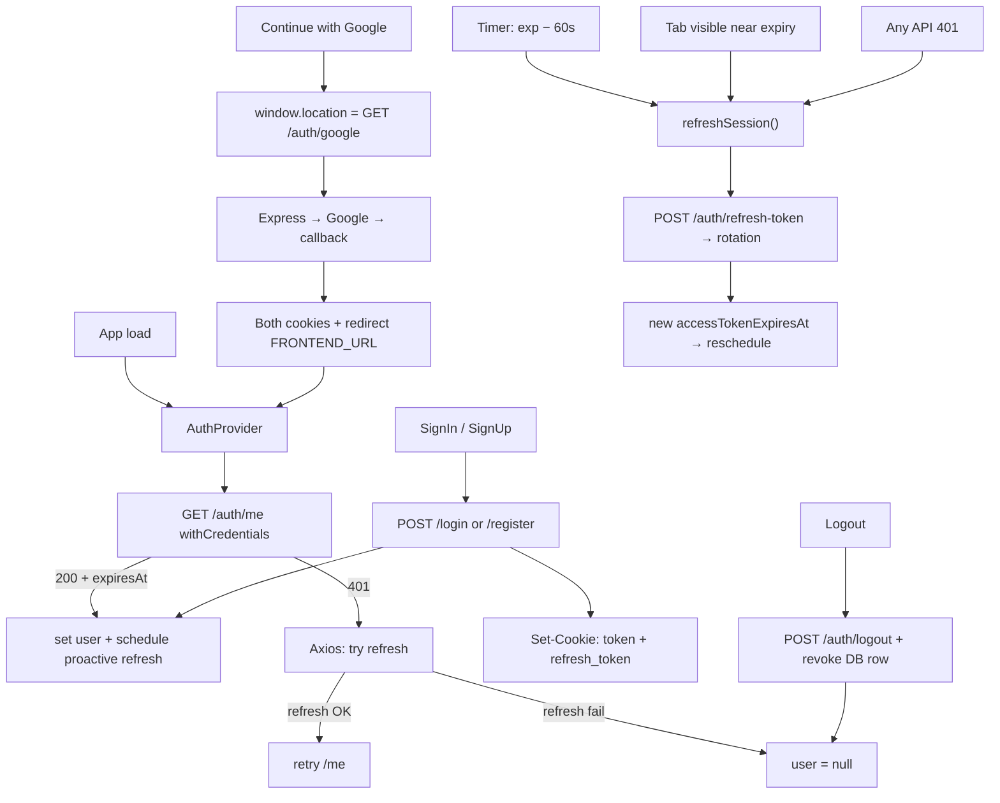

# Frontend Authentication Implementation Plan

## Decision (locked)

**Dual httpOnly cookie session** matching the backend:

| Cookie | Type | Lifetime | Role |
| ------ | ---- | -------- | ---- |
| `token` | Short-lived access JWT | ~15m (`JWT_EXPIRES_IN`) | Auth for every protected API call |
| `refresh_token` | Opaque random string (hashed in DB) | ~30d (`REFRESH_TOKEN_EXPIRES_IN`) | Only used by `POST /auth/refresh-token` |

The SPA never stores tokens in `localStorage`. Axios uses `withCredentials: true`. Auth state = `user` from `GET /auth/me`, plus `accessTokenExpiresAt` from JSON responses so the client can schedule proactive refresh (JS cannot read httpOnly cookies).

**Google:** Frontend does **not** use `@react-oauth/google` or `VITE_GOOGLE_CLIENT_ID`. The button full-navigates to `GET ${VITE_API_URL}/auth/google`. Backend talks to Google, sets both cookies on callback, then redirects to `FRONTEND_URL`. React discovers the session via `/me`.



---

## Backend contract (current)

| Concern | Contract |
| ------- | -------- |
| Email auth | `POST /auth/register`, `POST /auth/login` → `{ message, user, accessTokenExpiresAt }` + both cookies |
| Session | `GET /auth/me` → `{ user, accessTokenExpiresAt }`; `POST /auth/logout` revokes refresh row + clears both cookies |
| Refresh | `POST /auth/refresh-token` (refresh cookie) → rotate → new pair + `{ user, accessTokenExpiresAt }` |
| Google | `GET /auth/google` → Google; callback → both cookies + redirect to frontend |
| Register body | `{ firstName, lastName, username, email, password }` |
| OAuth errors | Backend redirects to `/signIn?error=google_denied` (etc.) |

`accessTokenExpiresAt` is an ISO timestamp derived from the access JWT `exp`. Required because the access cookie is httpOnly.

---

## Session refresh architecture

**Primary = proactive. Backup = Axios interceptor.** Both call the same `refreshSession()` helper.

### Why proactive is primary

Assume access JWT expires after 15 minutes. Refreshing shortly before `exp` means the user usually never hits a 401:

```
Login
  ↓
accessTokenExpiresAt = 10:15
  ↓
schedule refresh at 10:14 (exp − 60s safety margin)
  ↓
refreshSession()
  ↓
new access JWT + rotated refresh token + new accessTokenExpiresAt
  ↓
reschedule for next expiry − 60s
```

Benefits:

- Fewer 401 responses
- No failed API request waiting for refresh
- Better UX
- Normal API calls do not trigger auth recovery
- Can refresh while the app is idle

**Do not hardcode “every 12 minutes.”** Schedule from real `accessTokenExpiresAt` with a safety margin (`SAFETY_MARGIN_MS = 60_000`, `MIN_REFRESH_DELAY_MS = 5_000`).

### Why the Axios interceptor still exists (safety net)

Proactive refresh can miss:

- Laptop sleep / browser-throttled timers
- Network unavailable during proactive refresh
- Multi-tab timing edge cases
- User stayed on the page longer than expected
- Temporary refresh failure

```
API request → 401
  → refreshSession()
  → retry original request
  → if refresh fails → clearSession()
```

Login / register / refresh / logout URLs skip the refresh attempt (avoid loops).

### Single-flight

Five concurrent 401s must not fire five refresh POSTs:

```
Request A–E → 401 → ONE refreshSession() in-flight promise
                  → new cookies
                  → retry A–E
```

Implemented in [`refreshSession.ts`](../src/features/auth/api/refreshSession.ts) with a module-level `inFlight` promise.

### Multi-tab coordination

Refresh **rotates** the refresh token (old row revoked). Two tabs refreshing at once can look like token theft (reuse of revoked token → revoke all sessions).

Coordination:

- `localStorage` lock (`auth-refresh-lock`)
- `BroadcastChannel` (`auth-refresh`) so peer tabs wait and receive the new `accessTokenExpiresAt`

### Interview answer

> I'd primarily refresh the access token proactively shortly before it expires, so users normally don't encounter a 401. I'd still have an Axios response interceptor as a safety net for cases where the proactive refresh doesn't happen. The refresh operation should be single-flight so concurrent requests don't trigger multiple refreshes, and in a multi-tab application I'd coordinate refreshes across tabs.

---

## Key frontend files

| File | Role |
| ---- | ---- |
| [`axios.ts`](../src/api/axios.ts) | `withCredentials`; 401 → `refreshSession` → retry; failed refresh → `onUnauthorized` |
| [`refreshSession.ts`](../src/features/auth/api/refreshSession.ts) | Bare axios client (no interceptors); single-flight + multi-tab lock |
| [`auth.service.ts`](../src/features/auth/api/auth.service.ts) | login / register / me / logout / forgot / reset / `getGoogleAuthUrl` |
| [`AuthProvider.tsx`](../src/features/auth/context/AuthProvider.tsx) | `/me` bootstrap; schedule from `accessTokenExpiresAt`; visibility catch-up |
| [`auth.types.ts`](../src/features/auth/types/auth.types.ts) | `User`, responses include `accessTokenExpiresAt` |

---

## Flow summary

### Login / register / Google

1. Backend `createSession` → access JWT + opaque refresh (hashed in DB)
2. `Set-Cookie: token` + `Set-Cookie: refresh_token`
3. JSON includes `user` + `accessTokenExpiresAt` (Google: cookies only; `/me` supplies expiry on return)
4. AuthProvider sets `user` and schedules proactive refresh

### Normal API call

Browser sends `token` cookie → auth middleware verifies JWT → OK. Refresh cookie unused.

### Access expired

1. **Preferred:** timer fires at `exp − 60s` → `refreshSession()` → rotation → reschedule  
2. **Backup:** API returns 401 → interceptor → same `refreshSession()` → retry  
3. Refresh fails → clear both cookies (backend) + `user = null` (frontend)

### Logout / password reset

Logout revokes the current refresh row and clears cookies. Password reset revokes **all** refresh rows for that user.

---

## Env

**Frontend:** `VITE_API_URL=http://localhost:5000/api/v1` (no Google client id).

**Backend (relevant):**

```
JWT_EXPIRES_IN=15m
REFRESH_TOKEN_EXPIRES_IN=30d
```

---

## Smoke test checklist

- [ ] Register / login → both cookies present → `/me` works
- [ ] Stay logged in across access expiry via proactive refresh (watch Network for `/refresh-token` before 401s)
- [ ] Force access expiry / sleep tab → next API call recovers via interceptor or visibility refresh
- [ ] Two tabs open → only one refresh POST when both would refresh
- [ ] Google button → consent → home logged in; `/me` schedules refresh
- [ ] OAuth cancel → `/signIn?error=...`
- [ ] Logout → cookies gone → protected routes redirect
- [ ] Hard refresh while logged in → AuthProvider `/me` restores session

---

## Out of scope

- Storing JWT in `localStorage` / client-set `Authorization` header from the SPA  
- `@react-oauth/google` / GIS ID-token flow  
- Changing backend cookie names or OAuth redirect contract
